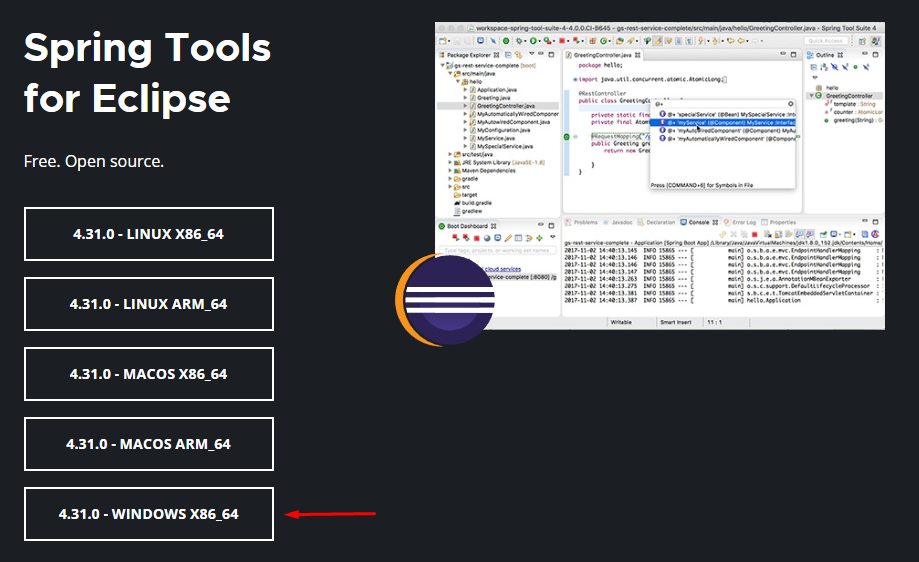
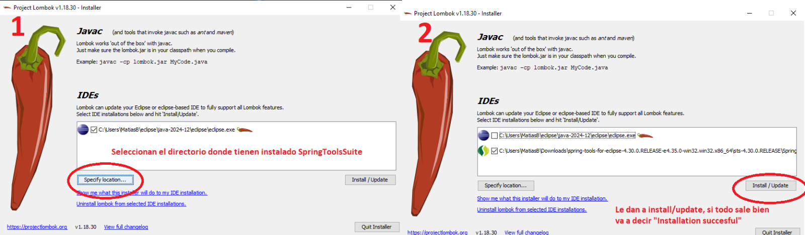

# Proyecto Turnos Genericos UNLa

Este proyecto es una aplicación web desarrollada en Java utilizando Spring Boot, Hibernate y Thymeleaf, cuyo objetivo es permitir la **gestión eficiente de turnos** entre clientes y empleados dentro de un establecimiento que ofrece distintos servicios.


## Funcionalidades

- ✅ ABM completo de Turnos, Clientes, Empleados y Servicios.
- 📅 Selección de fecha y servicio disponible por parte del cliente.
- 👤 Gestión de usuarios: clientes y empleados.
- 📧 Envío automático de correo electrónico al cliente con los datos completos del turno confirmado.
- 🔐 Control de acceso mediante rol (`Administrador`).


##  Requisitos Previos

Antes de ejecutar el proyecto, asegurate de contar con los siguientes componentes instalados:

#### 1. Spring Tool Suite (STS)
Descargalo desde: [https://spring.io/tools](https://spring.io/tools)

> ⚠️ Asegurate de instalar la versión para Eclipse.



#### 2. Lombok
Descargalo desde: [https://projectlombok.org/download](https://projectlombok.org/download).

Para lombok es necesario instalarlo en la ruta donde se encuentra previamente instalado sts. Luego de descargar el `.jar`, ejecutalo y seleccioná el directorio donde tengas instalado **Spring Tool Suite** para integrarlo correctamente.



#### 3. Base de Datos

Es necesario crear previamente la base de datos que será utilizada por el proyecto. Asegurate de que el nombre coincida con el valor configurado en `DB_URL` dentro del archivo `application.yml`.

Además, una vez iniciado el proyecto, se recomienda ejecutar un script adicional para insertar las especialidades médicas y asociarlas con los empleados que ya se cargan automáticamente.

➡️ Ver sección [Script SQL Inicial](#script-sql-inicial) para más detalles.

#### 4. Variables de Entorno

Además, es necesario configurar las variables de entorno que utiliza el archivo `application.yml` del proyecto para conectarse tanto a la **base de datos** como al **correo electrónico**.

Las variables requeridas son:

- `DB_URL`: URL de conexión a la base de datos (por ejemplo, `jdbc:mysql://localhost:3306/mi_base_datos_spring`)
- `USERNAME`: Usuario de la base de datos
- `PASSWORD`: Contraseña de la base de datos
- `EMAIL_USERNAME`: Dirección de correo que se utilizará para enviar notificaciones (verificacion en 2 pasos activada si o si)
- `EMAIL_PASSWORD`: Se debe generar una Contraseña de Aplicacion desde una cuenta de Gmail (verificacion en 2 pasos activada si o si)

Estas variables deben estar definidas en tu sistema operativo o bien en un archivo `.env` si usás herramientas como Spring Boot DevTools o Docker.


## Ejecución

Para ejecutar el proyecto:

    1. Cloná el repositorio.
    2. Configurá el archivo `application.yml` o `.properties` con los datos de tu base de datos y cuenta de email.
    3. Ejecutá la aplicación con tu IDE (por ejemplo Eclipse o IntelliJ).
    4. Accedé desde el navegador a: [http://localhost:8080]


## Script SQL Inicial

A continuación se detallan los scripts necesarios para crear la base de datos y poblarla con datos esenciales para el funcionamiento del sistema:

```sql
-- Crear la base de datos (si no existe)
CREATE DATABASE IF NOT EXISTS `mi_base_datos_spring`;

-- Usar la base de datos
USE `mi_base_datos_spring`;

-- Insertar especialidades
INSERT INTO especialidad (nombre) VALUES
('Neurología'),
('Cardiología'),
('Traumatología');

-- Asociar especialidades a empleados (IDs 1 a 5)
INSERT INTO empleado_especialidad (id_empleado, id_especialidad) VALUES
(1, 1),
(1, 3),
(2, 2),
(3, 1),
(3, 2),
(4, 3),
(5, 2);
```
# 📌 Instrucciones para realizar solicitudes POST en la API

Este proyecto cuenta con varios endpoints que permiten cargar información en la base de datos mediante peticiones POST. A continuación se detallan los diferentes **JSON** que deben utilizarse según el tipo de entidad.  
> ⚠️ **Importante**: Asegúrese de que todos los ID referenciados existan previamente en la base de datos.

---

## 🗓️ POST - Crear un Turno

**Endpoint:** `/api/turnos`  
Este JSON permite cargar un nuevo turno.

```json
{
  "hora": "10:30:00",
  "idCliente": 7,
  "idEmpleado": 2,
  "idServicio": 3,
  "idDia": 4
}
```

## 🗓️ POST - Crear un Empleado

**Endpoint:** `/api/empleado`  
Este JSON permite cargar un nuevo empleado.

```json
{
  "nombre": "NombreEjemplo",
  "apellido": "ApellidoEjemplo",
  "dni": 41855575,
  "cuil": "12345678910",
  "email": "email@example.com",
  "username": "UsernameEjemplo",
  "password": "ContraEjemplo",
  "fechaDeNacimiento": "1999-07-25",
  "estado": true,
  "rol": "EMPLEADO",
  "establecimientoId": 1,
  "especialidadesIds": [3]
}
```
## 🗓️ POST - Login
**Endpoint:** `/api/auth/login`  
Este JSON se utiliza para autenticar un usuario en el sistema.

```json
{
  "username": "empleado1@example.com",
  "password": "1234"
}
```
## 🗓️ POST - Crear un Cliente
**Endpoint:** `/api/clientes` 
```json
{
  "username": "mario.rossi",
  "password": "4567",
  "nombre": "Mario",
  "apellido": "Rossi",
  "dni": "12345678",
  "email": "mario.rossi@gmail.com",
  "fechaDeNacimiento": "1990-05-30",
  "fechaRegistro": "2025-07-22",
  "estado": true,
  "turnosIds": []
}
```


## Autores

Grupo 20 - Universidad Nacional de Lanus

- [@rober-7](https://github.com/rober-7)
- [@materivas](https://github.com/materivas)
- [@martinhildebrandt26](https://github.com/martinhildebrandt26)
- [@Matbas99](https://github.com/Matbas99)


